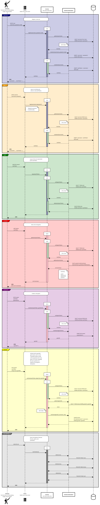

# ♕ BYU CS 240 Chess

This project demonstrates mastery of proper software design, client/server architecture, networking using HTTP and WebSocket, database persistence, unit testing, serialization, and security.

## Architecture Overview

The application implements a multiplayer chess server and a command line chess client.

[](https://sequencediagram.org/index.html?presentationMode=readOnly#initialData=JYWwhg5gpgBAJmALmAXKSUD0AHAdhAbgCMwBnKANgBYAaYANQCEB5AJQHcAGAaQHEIA9gEERQgHIBlAKoALAKJSIogCIBJUUICeAYSEBNDVAAKVYAA8N2gBqNVAdSsBZUaQAqogDJz2coSGzsBiLK3FIANnIAivSsVLhidmBWejJiUqyuABIAZgAcAFphAFLajmEAXvlCYADWEMAAYqoQuVDljsxUIABuQhD5VppSVAIAjFS5umACigJmAMaOnJoArnYNDZrM2Y565WbcpDXKHpqqYmYgMo4AVvOZVLwNuTcATthEdgCOcKMrAMzlbq4G7KMK4ACcwKsX0Q3SgYAArAAmcqYborUg3f7-ZErKorcpCbTIoTsZE1XgeZhCZScIRQKByejcRxSEBwcoUbrzIpUKTCMxUMBFZRUZS5Tj9VgQZRiRgCGoAaj0jBq2FY50YVAgSvYwFYrGA3U4DW0+UYuWwZky2AhfV4RUc-0yCGUiJ8mGAwE0cHmnGAfj0o3o7FUEmUrFerwg7Ao+QgRWyr3mjNG5Qa2DsRiVyhW8yEuCoiK+RkQvFeDQgpEQFBqnEgVm4MTMmioYiomS+mQgzCMQjgzG0YkiIrgSs4cHIh3+X1BjpW2GD7G0K1GyLAUlGrwOynK2iIIEYUTkUHuLRkvG4nFYmCEDSkNVpzB4YUivDkYVeN0TCT9AmUf5wlGIgalwAQrBqKBNAhTh8lUCFEHobNsBuIgbgAdjMOwzCiCBuH+fJlCITRWysCREG2REIEcKxMkcSI5CMGoig8IRGFJVRumAOAHkQelDmAZEIH+bQwhojDlGQ-4ij0XAvmuV4iiEeY1huOAVk4JDRkiKRXhACQViEVR5kYbIqCsUh3QEBpuCKKwQBAUzVCIbAii+ZF8EYRxNG6cFRk4TJlAEbgVmvDxsigCRuA8XhQ2YZFImUGoQCoVx6F4DDJEyThsCsMRely9QX1Yeg0IEdgQrMVhyKgIR-isdjGC8IV5Fnbo4CZTkVnYRgpF4TReD0bgGgEG45FwEBSDgXBmEcUgwH+MAIVUPQpA8VhHSsBo7Aw3gQCMRxtFbSReAkIxkUQKxEVYL5IgoVRsCeMBcGyDwxDOdSdjsGQagkIgwkQVQzHobojHKBU4GUOREDCfI9GUDFlHmL4PDgIx6CEZhXnof5VWRYAoCkeg5FIUJslUV4rEwcttHoPRcioDDRkYeYIHmKRylwVgzBWbovnGVxNEibRcA8CRkzEeYGg8RBMmYDDgC7DxkdpCgcRqVgil4dganYKx2EyEBGqVKwMM0DgMLAbo5DsMIjGwMJvhk0ZmDGmpckYSJ8lYREjAKbBNBqN6jBAFZcE4MRXgoMwblGeZcjAXIlXmBPOG6XDlBATIBE4FZHCVCRXkyTBtA9yJcj0Kg9EicoUqgMQwgoMAQDCXJcnV3JHAECh6FwFYrEiZElX+DClTi0hEXKDD8nyf4IR6QkjDCTAQiVRxVG4LnMA8GvXm6AQBlGeQVjbA-XjvUZukybg7CkMx-iESYPAoRxumyJBV+4OaPDuoRgAwhADCVBRhmAoOUMINRMjlA8EeIgB5gCvHJBQbI7BNDgmYJoZQDRWB2DEPsbgRA4zaCQawX6vBED5AkKQbIcABB6EcB4dgNoVjAFUFgRECAlSuDsMHTgyIvhCHoBhL4tRsD5BuJEV4iJXDAG4MiLiqgsrdHYA0IQyJMCcFGKMEAnAN6RA0EIaQ9A2DcERNoPQqhVAwAAEQACo7GFkQAIXAwBMQOIADq4FcFAfSwBcBgDCDAeYYRCa4EQDAAQ2QYDaBkFAUgpAYCOzAJofxEAYBeLAsACAMhEA0BgE4lxbjEmMDCAIeYNQbEwDIAUgAUOARAvjgCBM6qQbJrj5guMSdkTgEwiC2IcRIXx8JXieNwMoBEiAZAAHJEkVVwMEuJCSYDkH3r4qpNShlrNeLU7AYBXiIGAPMYAezwkDLsVs7iqZSBjKkKs-JQgVhTPybwFuUB8kTO6BsxJlyjnxN2fsw5xzTkRPsXY5QSAwAqWuaQOQCwoDYEOS4hx3yYAQuQNC+JsL4WIuAC42pCBkAkHIPAIgtTakAB4SAVIgK8AQ4c4AoAAMS0pSQAPlqVAcJrxNCkD2cc-AMBOAADoKDkvJbS+l2AYBMoCd0TQMBWBQHqDWV4SA8ULKZewGQwBGm1NeEQOYkSRkwEub4mgvzrkoCVSqxprxqkwFwFAdgMBMS+OFbUoQMAAC0bLTXDN8SgGAABtIwzAJCuAALowEwG614XiADecaAkgHeUksgpBKqvDgPkqA4BgBhAAL61MNWYY1vj-X7z+aQFAdzfG1LAPMQ53QkCwEtfEmVuQiC5DgEQf4tSzX2t9ZWq58Sg2vGVcAGsviAAUya3n5L2QkrNOaYB5rAAWgAlAO4Z1afV+vRVC1OWK4WplxS4oN0BEB1teHO1ZKaoDbsPZihJp6EVIoWcO3tQaJByC8NoVwrr71vJgA0OlIAYA3tIF4uwmQ5CsDkEB3xD6AC8FL52po5eBRpMAwhQGyBEqJaLIUvuxWej9KAqCcH+DAYA0TkBQVwLU59x7X04o-T64d7aa03sPTuqt1z93EYxaxsj76NUoHmBO1tN673IYXem5dAhs25vzWEJ9JHRNvvPZ+v137zi-oyDAdDwHMP5IpUuzNym4BspoF4il66C1+vOK4ZgkHVmkBLUagQJruMoEeVMhtTbjStpHXuplRAKC9qIBhfjo7EnDpYzC7TFHgnScaQFmQcnXgPo0yJ5L7GNVCf05IeDgGKVgCeTIVwiouW2eMxhqAbKvEubc5l5jmmCvkaK96rju6rWZb451RtzbQvcfJdxzjfrB3+aq0NhEwWW04fG4OqbBSUAOODciTgnBI1jITTYxrNig02JsfkmxlWpk1cY8d2xNji1crgOK2pkrFwyuUy9aAMAPACHqJq7VuqoD6tLeW+1g6LX9bHRSld7A1XYBQP8TgbKfvVlowsl6a6zBTsOYKuNMAZ0TsQCsHLiSwCOuddUqr12uWbo9V63r02A2vCDaG8NUaY3kASRqxNjXF0ZpXcWkHPmK1+ZvUF0by3IeJKZV2ntfa4sVr6wJsdZS-vZYffkpllmV12O3dh2Arxsm5MidEmbMA7GqGG2EMICqpmwG19ZrxU6YAyDIHEuAuHymBJt3FvdiXOsnsKxeq9snGt5aPV18TLjitEBQL+-9gHGugdYHNdzvjoO4Fg-BxDjW0ONawwIHDeGCMm+ExHwP3WL1UdGJEhZH8C0dfyxXqPn6lfxdrasvjQvfNS6De1kbIXJfK+l5F6LsXJv+6b2xyvuBJPpbqlV9Xbzw+kZSz1vTseDNlYa6Zpr5nLvVdq7gP1LWxCuYKVVxv5fp8t7W35wbkKCULYl22qXvvBMM5HYGh-yAn8D6W6-sPgrkOsOkIBtnYltjtntnYomodrvrdqdudgftTrPndoWjQJyrgE9uKq9tKiyhOlyt9r9vShElqjqnqgat5j3tshDsPigNDtZrDmAPDojsjr9nMk8jAHbkhvahOtgBOuQOElAB7iRFwXEpTldkfnTkJmbsGtDF4K4HINGpgJzm0i4l4sgUfl5mWsLmDr3mLv-mNlLp2t2r2v2qtm3tWigKriQTOpoYxtut3iLr3v3otkYcPjKqPkQDFu-h2pPtfmJjpkGiMnRpoHYVTkfivlpkHrpqSnHn+nIABubsnqngfhkpnnBghlwUfihvYVyrUvrrhvhoRtEkls3kEdXrXjAPXmELUnyo2kDmUTfjpnfi4XNo-sNm4UPvFpgYgDyvUQKukiKoiHUfykDoYd0eFl4T4RPgegHs0alp1HhhlovnkbgFEZHi0V+rHvIXIIoSkY4BflMukVnlkWsWhmsRyk0YERxp-n5n-l0YAT0RPm3oGuSp0S-mFtcsAWtmAZtttrtg4pgdgRKnSm9kyhOh7h4NjjAK8qmtLgDhQU4XoTQX5rwMaB2mTqEjWKXt7jABAG8qQNIa8cziGh+OzpgASamhoREYxtoaDl8WOnCeMY8YydLtgP4jUD8ZYVaviVAOWISeEZIQ4fSboWybNoFhMU8VMVFt4ePsYf4avjEcEU0tkGEWsRseUbcRvvEQnskTgqnplicZkYhs4oxrkbSfkYUcXiUWXkqTPpRlolUTUVfvabfncW0VMvNlKWyb4QlnMVPjcRJlesyYZI5PsoTKQDOpqQsevnEfHokYBlSVAKoMoPkoiUTKsmIApl4gDI2jUDetmamvksmUWbAAaYccyZ5tcWvtHh6XQdCTWBSmGeADygXkXsUaXjWcqS2fspoCgF4r1l4smamV4hmTeg+rmWEPmROW8sOW8mWX6a0dsigI2YgM2SsOGW2Q8Z8Stkzr8eAZAYCTAbgEUBIMwGIN9jCURqQJua2ZGcCc9rgTKtgMTo7LACQpMrAMyTKhmcDlQc4TQeKQwdmkwSwUjp+a2qTuTi6smcSYziuSGmGhGsocmTScKVyomqWW8oLgBSie3rCW8uLoPtKYJlrpydyQhe3lJl+cyUKYfoxiWQucvqKdQe3q4bucYRFrKTMQqQGQEbWbPiEWqfRSgTGUGXWTqQmUkUnhWUcTIMadnhIQxVyhaRhUxtaZ2URt2Q6ZUdHi6Tpe6TyWOj-mADuSRb6UuYqdEQ6TRa2nRdhamuJYJTHigFvkZq1oRfCekTOhSo5U1s5TEcue3iOcoFZSSZem8qmeZQAb6RYaAYeQCdAbASOXALdg9lgU+WCXgZoFANbhVDAEUAIP4l5bABFtORUv+ToWxean5iBXAGBQjkjvQKqZGWIUgGIbAHymeHRoTB7smZjtjqQPki9KunRg6p0mUvas7t1cctkH1SNXAFOJ1cEt7hWjUtwROl8CsPEo0h7pNcptkStXBTAKoNEuBMEgIFNbRokrNb1cIStXjs7jcMVU6h7jUhjgIEQKsiMsKjAK4DqokltTtTic7jxHmtgIXlyogPBV-qSaGlIBSWhQEpabgImsvCkr4toFdcpkxamqmbhdVYBQRcycRbFZNuRbgFyRYVRVYS9f4nRWsYutObla8NjVNXjSmcoI4XheKfJWTe4fFp4TxfKR4dZZsRRsJeqajYFTPq5dJYnrvgcfJYpWcajRcaje2bADaV2fMRJbPnpXXhurUYZVscZTWqZTFYLdWlZfxW6UEXyQKamjOqFbLe6VJQkUkXYsrVWTAKcYhqFWhqFVcXrS5fWe3qTZpSXkRn5lRjRuNQxvkbMXaTZS3igDWICg5VFWmTwRrpdVNW7VsTqVIEYMoEIPsb7V4r+oBuObvnYnnrvrZjBiafidnUHdnSHYGWHebSgOFVRW8R8RZXudsgef8VAUCY9llVKjKqygqmJAiPaswY7EcuqtHmQYDuSpQUTfhbVb3vVY1awfPfsoktwYSmAMSlAH9UqiAMLqTtbjwcNa3fCSNVgcpSgUSZ6jIUzizrsYocob2qxcTVYZ8gLZMWRbPZReKSEgvYehfdGbbSnRLRJksfyZmenvA6bR+r6t+q4KwFIGILoPse4M1IhlBq6anWbbTVan6b6pg8g3lag1WRg6HTEdg7Hrg-g4Q4hsQ14KVdWSw3LeHVYTQ2ynQxeigysVMsw13UFdsSgBwwQ+Xdw+xLw+1mI63lQ2On3XDb3YPeTW-vFX6n8RAUlRPZlV5ogM4v4ICkcici9IgJ5kAA)

## IntelliJ Support

Open the project directory in IntelliJ in order to develop, run, and debug your code using an IDE.

## Maven Support

You can use the following commands to build, test, package, and run your code.

| Command                    | Description                                     |
| -------------------------- | ----------------------------------------------- |
| `mvn compile`              | Builds the code                                 |
| `mvn package`              | Run the tests and build an Uber jar file        |
| `mvn package -DskipTests`  | Build an Uber jar file                          |
| `mvn install`              | Installs the packages into the local repository |
| `mvn test`                 | Run all the tests                               |
| `mvn -pl shared test`     | Run all the shared tests                        |
| `mvn -pl client exec:java` | Build and run the client `Main`                 |
| `mvn -pl server exec:java` | Build and run the server `Main`                 |

These commands are configured by the `pom.xml` (Project Object Model) files. There is a POM file in the root of the project, and one in each of the modules. The root POM defines any global dependencies and references the module POM files.

### Running the program using Java

Once you have compiled your project into an uber jar, you can execute it with the following command.

```sh
java -jar client/target/client-jar-with-dependencies.jar

♕ 240 Chess Client: chess.ChessPiece@7852e922
```
